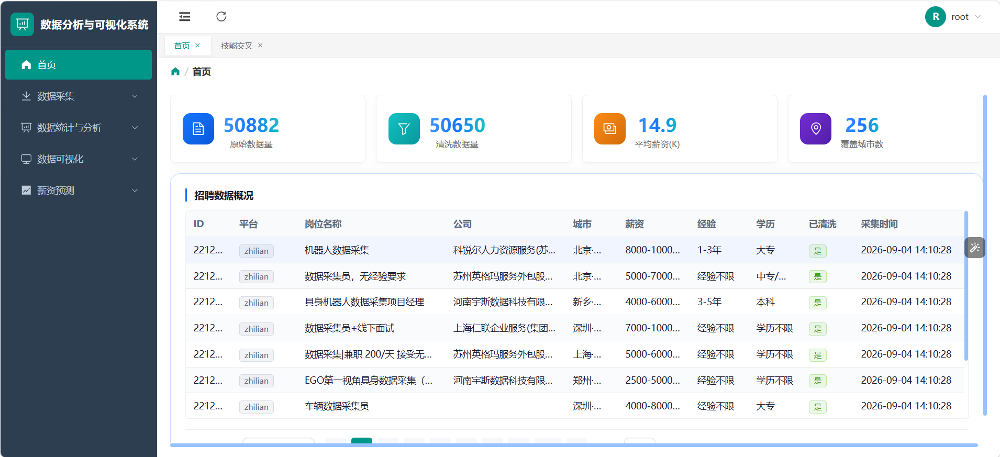
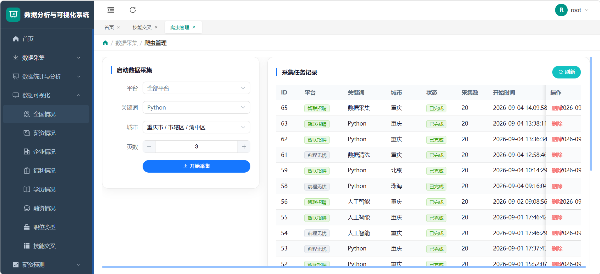
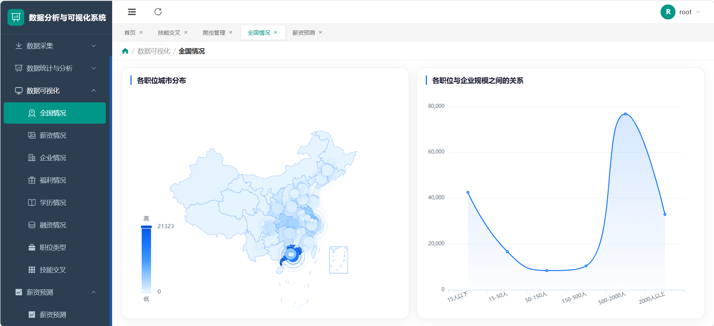
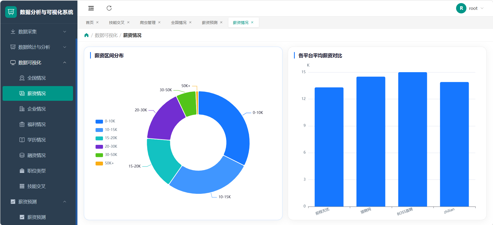
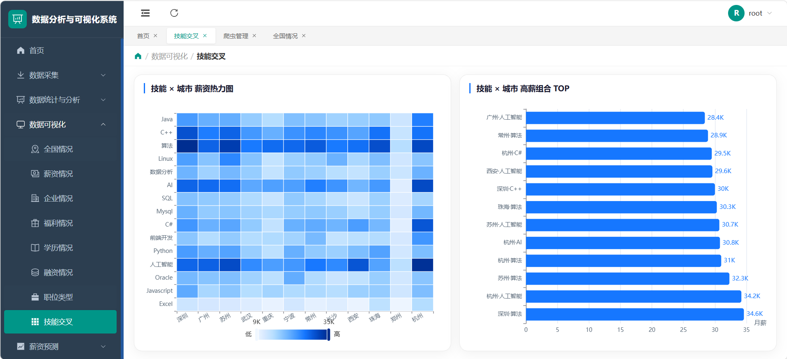
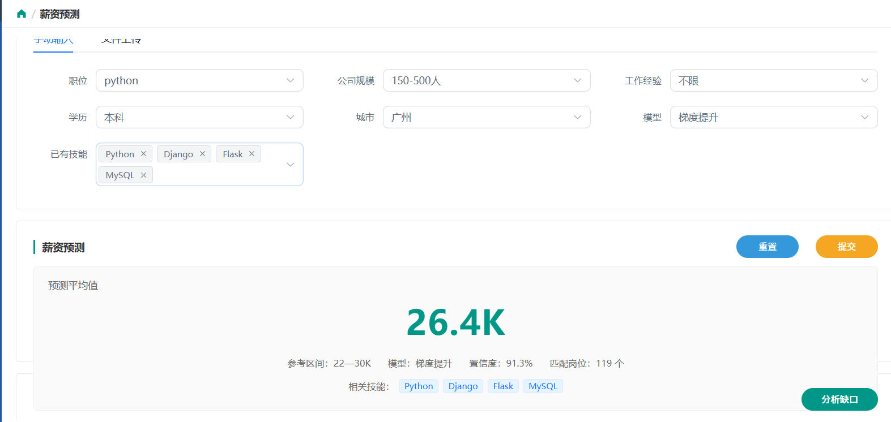
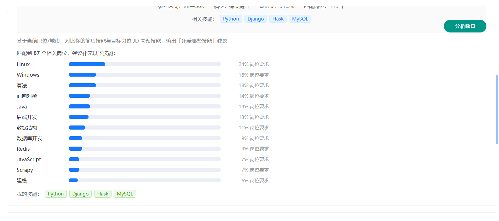

# 招聘信息爬虫与薪资预测系统

一个覆盖 **数据采集 → 数据清洗 → 特征工程 → 机器学习建模 → 可视化展示** 全流程的招聘数据分析平台。

基于 Scrapy + Selenium 采集拉勾、猎聘、前程无忧、智联招聘四大平台的职位数据，通过 XGBoost / CatBoost / 梯度提升 / Stacking 集成等多模型对岗位薪资进行回归预测，并提供 Web 可视化看板与 API 服务。

## 功能特性

- **多平台爬虫**：Scrapy + Selenium 动态渲染采集 4 个主流招聘平台（拉勾、猎聘、前程无忧、智联），支持反自动化检测与按平台等待列表渲染
- **数据清洗**：职位数据标准化清洗（薪资区间解析、学历/城市/公司规模归一化、技能标签抽取）
- **薪资预测**：XGBoost、CatBoost、GradientBoosting、Stacking 集成四模型对比，RandomizedSearchCV 超参数搜索，RobustScaler 特征缩放
- **数据可视化**：ECharts 展示城市/行业/薪资分布、全国热力地图、趋势分析等
- **简历解析**：支持上传 PDF / Word 简历并抽取技能与经历关键词
- **用户体系**：JWT 认证 + 登录注册，爬虫任务管理与进度监控

## 系统展示

### 首页 · 平台介绍
整合四大招聘平台数据采集与 AI 薪资预测，内置智能助手。


### 数据概览
原始 / 清洗数据量、平均薪资、覆盖城市等核心指标一览。



### 爬虫管理
按平台 / 关键词 / 城市 / 页数一键启动采集，实时查看任务状态。



### 全国可视化
职位城市分布地图 + 企业规模与薪资关系曲线。



### 薪资分析
薪资区间分布与各平台平均薪资对比。



### 技能交叉分析
技能 × 城市薪资热力图，以及高薪组合 TOP 榜。



### 薪资预测
选择职位、公司规模、学历、城市与模型，秒级输出预测薪资与置信区间。



### 技能缺口分析
基于你的简历技能与目标岗位 JD，推荐补充技能方向。



## 技术栈

| 模块 | 技术 |
| ---- | ---- |
| 爬虫 | Scrapy 2.11、Selenium、undetected-chromedriver |
| 后端 | Flask 3.0、Flask-SQLAlchemy、PyJWT、APScheduler |
| 数据库 | MySQL 8（PyMySQL） |
| 前端 | Vue 3、Vite 5、Element Plus、ECharts、Pinia、Vue Router |
| 机器学习 | XGBoost、CatBoost、scikit-learn（GradientBoosting / Stacking / RobustScaler） |

## 项目结构

```
├── recuitment_spider/          # Scrapy 爬虫（4 个平台）
│   └── recuitment_spider/
│       ├── spiders/            # qcwy_spider / zhilian_spider / lagou_spider / liepin_spider
│       ├── middlewares.py      # Selenium 动态渲染中间件（反自动化检测）
│       ├── pipelines.py        # 数据入库 Pipeline
│       └── settings.py         # 爬虫配置
├── backend/                    # Flask 后端
│   ├── run.py                  # 启动入口（端口 5000）
│   ├── .env.example            # 环境变量模板
│   └── app/
│       ├── routes/             # auth / crawl / jobs / stats / rinse / predict 蓝图
│       ├── services/           # 爬虫调度、数据清洗、薪资预测、简历解析、统计服务
│       ├── models/             # SQLAlchemy 模型（user / job_raw / job_clean / crawl_task）
│       └── requirements.txt    # 后端依赖
├── frontend/                   # Vue3 前端
│   └── src/
│       ├── views/              # Dashboard / SalaryPredict / CrawlManage / VisualAnalysis 等
│       └── api/  router/  stores/  ...
└── ml/                         # 机器学习模块
    └── salary_forecast/
        ├── dataset/            # 数据加载（MySQL 读取）
        ├── feature_engineer.py # 特征工程
        ├── model/              # salary_predictor.py 四模型训练与评估
        └── config/             # 训练配置
```

## 快速开始

### 环境要求

- Python 3.11+
- Node.js 16+（前端构建）
- MySQL 8
- Microsoft Edge 或 Chrome（爬虫 Selenium 渲染）

### 1. 准备数据库

```sql
CREATE DATABASE recruitment_db DEFAULT CHARACTER SET utf8mb4 COLLATE utf8mb4_unicode_ci;
```

### 2. 配置环境变量

复制 `backend/.env.example` 为 `backend/.env`，按本机环境填写数据库连接信息：

```bash
# 关键配置项（值按需修改）
DB_HOST=localhost
DB_PORT=3306
DB_NAME=recruitment_db
DB_USER=root
DB_PASSWORD=你的数据库密码
SECRET_KEY=自定义的JWT密钥
```

### 3. 启动后端

```bash
cd backend
pip install -r app/requirements.txt
python run.py
```

启动后访问 `http://localhost:5000/api/health` 验证服务，数据库表结构会在首次启动时自动创建。

### 4. 启动前端

```bash
cd frontend
npm install
npm run dev
```

浏览器访问 Vite 输出的本地地址（默认 `http://localhost:5173`）。

### 5. 单独运行爬虫（可选）

```bash
cd recuitment_spider
scrapy crawl qcwy        # 前程无忧
scrapy crawl zhilian     # 智联招聘
scrapy crawl lagou       # 拉勾
scrapy crawl liepin      # 猎聘
```

## 机器学习模型

训练入口：`ml/salary_forecast/model/salary_predictor.py`，一次训练四个回归模型：

| 模型 | 说明 |
| ---- | ---- |
| XGBoost | 直方图加速 + RandomizedSearchCV 调参 + 早停 |
| CatBoost | 类别特征友好，3 折交叉验证调参 |
| GradientBoosting | 分阶段训练，输出每 50 轮 RMSE 进度 |
| Stacking 集成 | 前三者作基学习器 + Lasso 元学习器，5 折交叉验证 |

评估指标：R²、MAE、RMSE、相对误差、±20% 精度。训练完成后模型保存至 `ml/salary_forecast/save_models/`，训练过程的验证数据集与评估报告同步生成（模型与数据文件体积较大，未纳入版本控制，训练后自动生成）。

## API 一览

| 模块 | 前缀 | 说明 |
| ---- | ---- | ---- |
| 认证 | `/api/auth` | 注册 / 登录 / 用户信息 |
| 爬虫 | `/api/crawl` | 创建爬虫任务、任务状态监控 |
| 职位 | `/api/jobs` | 原始 / 清洗后职位数据查询 |
| 统计 | `/api/stats` | 城市 / 行业 / 薪资分布统计 |
| 清洗 | `/api/rinse` | 数据清洗处理 |
| 预测 | `/api/predict` | 薪资预测（多模型） |

## 说明

- `_backup/`、`node_modules/`、`.venv/`、模型文件、原始数据等大体积/本地文件已通过 `.gitignore` 排除，不入库
- 数据库账号密码为本地开发配置，请勿在公开环境复用；建议通过环境变量管理敏感配置
- 爬虫仅用于学习研究，请遵守目标网站 robots 协议与相关法律法规，控制采集频率

## License

本项目仅用于个人学习与作品展示，代码可自由参考。
